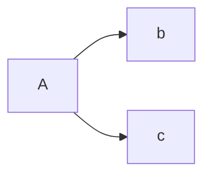
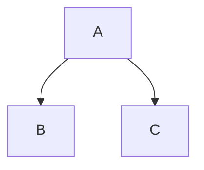
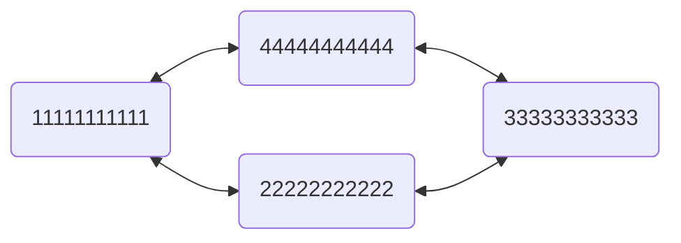
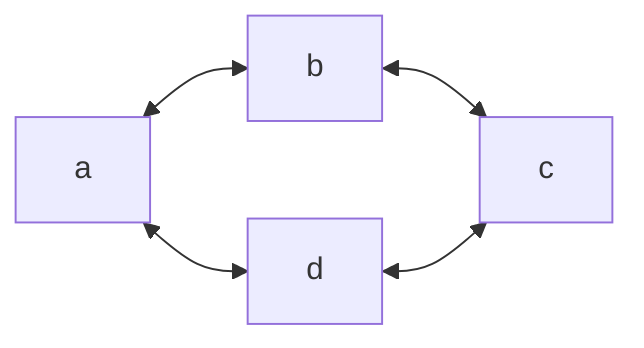
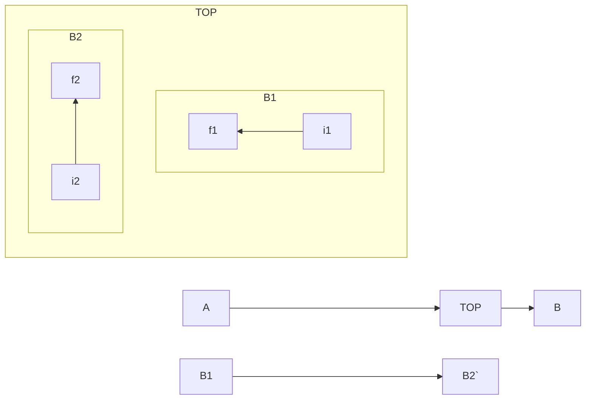
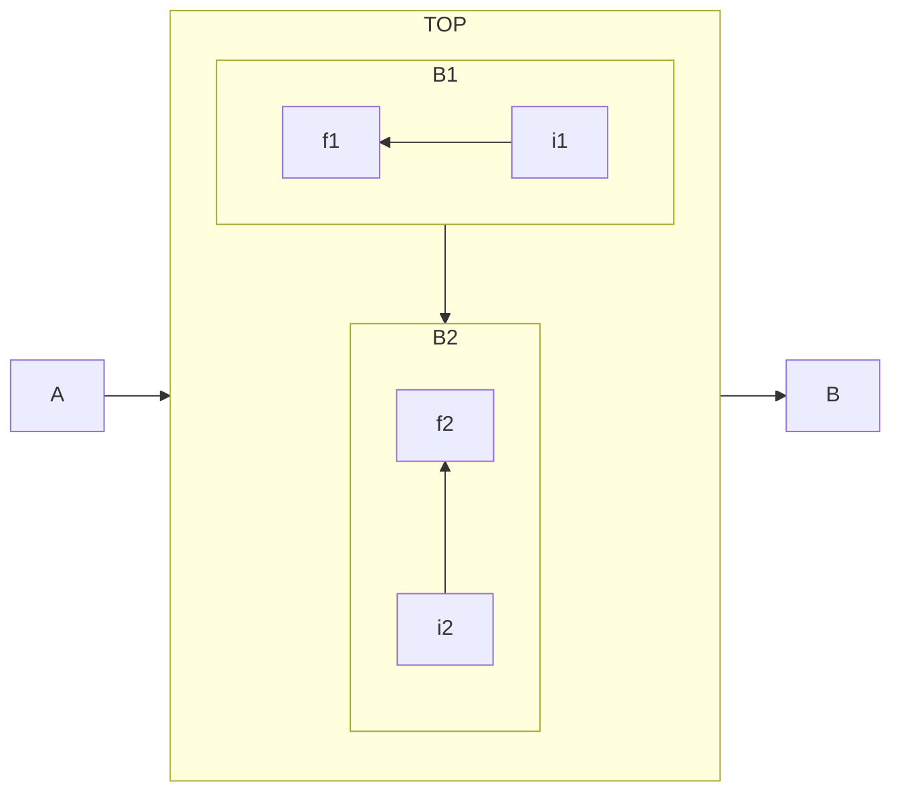

마크다운에서 수식을 작성할 때 사용하는 문법은 일반적으로 TeX 문법이지만 대부분의 마크다운 엔진 은 내부적으로 LaTeX 패키지를 사용하여 TeX 문법을 처리한다. 즉 TeX 문법을 사용하지만 LaTeX 로 렌더링된다.
# Ref

https://tomoyo.ivyro.net/123/wiki.php/TeX_%EB%B0%8F_LaTeX_%EC%88%98%EC%8B%9D_%EB%AC%B8%EB%B2%95

https://rayc20.tistory.com/151

https://velog.io/@d2h10s/LaTex-Markdown-%EC%88%98%EC%8B%9D-%EC%9E%91%EC%84%B1%EB%B2%95

# 조직도 (organization char) 작성 방법.

